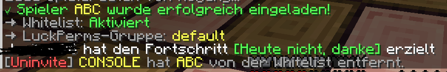

# 🎮 BetterWhitelist

<div align="center">

**A configurable Minecraft plugin that allows players to invite friends**

[](https://papermc.io/)
[](https://openjdk.org/)
[](LICENSE)

[Features](#-features) • [Installation](#-installation) • [Configuration](#-configuration) • [Commands](#-commands) • [Download](#-download)

[🇩🇪 Deutsche Version](README.md)

</div>

---

## 📖 About the Plugin

**BetterWhitelist** was developed to solve a common problem on private Minecraft servers:

> **The Problem:** Players always have to contact an admin when they want to invite a friend to the server. This is cumbersome and time-consuming.

> **The Solution:** BetterWhitelist gives trusted players the ability to add friends to the whitelist themselves – without needing admin rights.

### ✨ Why BetterWhitelist?

- 🤝 **Player Freedom**: Trusted players can independently invite friends
- 🔒 **Security**: Permission system prevents abuse
- 🌍 **Multilingual**: Supports German and English
- ⚡ **Performant**: Asynchronous processing, no server lag
- 🎯 **Flexible**: Optional LuckPerms integration for automatic group assignment
- 📝 **Simple**: Intuitive commands and clear messages

---

## � Screenshots

<div align="center">



*What it looks like when a player gets invited*

</div>

---

## �🚀 Features

### Core Features

| Feature | Description |
|---------|-------------|
| **🎫 Whitelist Management** | Easy adding/removing of players to/from the whitelist |
| **🔐 Permission System** | Two levels: `invite.use` and `invite.admin` |
| **🌐 Multilingual** | German and English fully supported |
| **⚙️ Configurable** | All settings customizable via `config.yml` |

### LuckPerms Integration

| Feature | Description |
|---------|-------------|
| **👥 Automatic Group Assignment** | New players automatically receive a configurable group |
| **🔄 Optional** | LuckPerms can be completely disabled |
| **📦 Flexible Configuration** | Default group freely selectable |

### Technical Features

| Feature | Description |
|---------|-------------|
| **⚡ Async Processing** | No server lag from blocking operations |
| **📡 Mojang API** | Official UUID lookup like `/whitelist add` |
| **📢 Broadcast System** | Notifications for player invitations |
| **🎨 Adventure API** | Modern text components for better presentation |

---

## 📥 Installation

### Step 1: Check Prerequisites

- ✅ **Server**: Paper, Purpur, or another Paper fork (1.21.x)
- ✅ **Java**: Version 21 or higher
- ⭕ **Optional**: LuckPerms (if group assignment is desired)

### Step 2: Install Plugin

1. [**Download**](#-download) the latest `BetterWhitelist-x.x.x.jar`
2. Copy the JAR file to your server's `plugins/` folder
3. Restart the server
4. The `config.yml` will be automatically created in `plugins/BetterWhitelist/`

### Step 3: Adjust Configuration

Open `plugins/BetterWhitelist/config.yml` and adjust the settings:

```yaml
language: "en"  # or "de" for German

luckperms:
  enabled: true              # Enable LuckPerms integration
  default-group: "default"   # Default group for new players
```

### Step 4: Assign Permissions

Assign the required permissions to players or groups:

```bash
# Players may invite friends
/lp group trusted permission set invite.use true

# Admins may remove players
/lp group admin permission set invite.admin true
```

✅ **Done!** The plugin is ready to use.

---

## ⚙️ Configuration

### Automatic Config Creation

The `config.yml` is **automatically created** on first start. You don't need to create anything manually!

Location: `plugins/BetterWhitelist/config.yml`

### Complete Config File

```yaml
# ============================================
# BetterWhitelist - Configuration
# ============================================

# ============================================
# Language / Sprache
# ============================================

# Choose the language for all plugin messages
# Wähle die Sprache für alle Plugin-Nachrichten
# 
# Available languages / Verfügbare Sprachen:
#   - de (Deutsch)
#   - en (English)
language: "en"

# ============================================
# LuckPerms Integration
# ============================================

# Should players be automatically added to a LuckPerms group?
# Sollen Spieler automatisch zu einer LuckPerms-Gruppe hinzugefügt werden?
# true = Enabled / Aktiviert | false = Disabled / Deaktiviert
luckperms:
  enabled: true
  
  # Name of the default group that new players should receive
  # Name der Standard-Gruppe, die neue Spieler erhalten sollen
  # This group must exist in LuckPerms!
  # Diese Gruppe muss in LuckPerms existieren!
  # Examples / Beispiele: default, member, player, newbie
  default-group: "default"
```

### Configuration Options

#### 🌐 `language`

- **Type**: String
- **Default**: `"en"`
- **Options**: `"de"` (German), `"en"` (English)
- **Description**: Sets the language for all plugin messages

#### ⚙️ `luckperms.enabled`

- **Type**: Boolean
- **Default**: `true`
- **Description**: Enables/Disables automatic LuckPerms group assignment
- **Note**: When `false`, players are only added to the whitelist without group changes

#### 👥 `luckperms.default-group`

- **Type**: String
- **Default**: `"default"`
- **Description**: Name of the group that invited players receive
- **Important**: This group must exist in LuckPerms!

### Creating a Group in LuckPerms

If the configured group doesn't exist yet:

```bash
# Create group
/lp creategroup mygroup

# Set permissions
/lp group mygroup permission set minecraft.command.help true
```

Check available groups with:

```bash
/lp listgroups
```

---

## 🎮 Commands

### `/invite <playername>`

**Description**: Invites a player to the server

**What happens:**
- ✅ Player is added to the whitelist
- ✅ (Optional) Player receives the configured LuckPerms group
- ✅ Broadcast to all players with `invite.use` permission

**Permission**: `invite.use`

**Examples:**
```bash
/invite Steve
/invite Alex
/invite Notch
```

**Output:**
```
✓ Player Steve was successfully invited!
→ Whitelist: Enabled
→ LuckPerms Group: default
```

---

### `/uninvite <playername>`

**Description**: Removes a player from the whitelist

**What happens:**
- ❌ Player is removed from the whitelist
- 📢 Broadcast to all players with `invite.admin` permission

**Permission**: `invite.admin`

**Examples:**
```bash
/uninvite Steve
/uninvite Alex
```

**Output:**
```
✓ Player Steve was removed from the whitelist!
```

---

## 🔐 Permissions

### Overview

| Permission | Default | Description |
|-----------|---------|-------------|
| `invite.use` | `false` | Allows inviting players |
| `invite.admin` | `false` | Allows removing players |

### Recommended Configuration

#### For Trusted Players

```bash
# Individual players
/lp user Steve permission set invite.use true

# Whole group
/lp group trusted permission set invite.use true
/lp user Steve parent add trusted
```

#### For Administrators

```bash
# Admins get both permissions
/lp group admin permission set invite.use true
/lp group admin permission set invite.admin true
```

#### For Moderators

```bash
# Moderators can only invite, not remove
/lp group moderator permission set invite.use true
```

---

## 📦 Download

### Latest Version

**Version**: 0.0.2

**Download**: [GitHub Releases](https://github.com/2g4y1/better-whitelist/releases)

### Changelog

#### Version 0.0.2
- ➕ Added multilingual support (German/English)
- ➕ Configuration file with language selection
- ➕ LuckPerms integration is now optionally configurable
- ➕ Default group is now configurable
- 🔄 LuckPerms is now an optional dependency (`softdepend` instead of `depend`)
- 📝 README completely revised

#### Version 0.0.1
- 🎉 Initial release
- ✨ `/invite` command with whitelist function
- ✨ `/uninvite` command for removal
- ✨ Automatic LuckPerms group assignment
- ✨ Permission system
- ✨ Broadcast messages

---

## 🛠️ Compilation

### Prerequisites

- **Java 21** (required for Paper 1.21.x)
- **Maven 3.6+**

### With Maven

```bash
mvn clean package
```

The finished JAR file can then be found in the `target/` folder.

### With Docker (if Java 21 is not available)

```bash
docker run --rm -v "$(pwd)":/app -w /app maven:3.9-eclipse-temurin-21 mvn clean package
```

---

## 🐛 Troubleshooting

### Problem: "LuckPerms not found"

**Solution**:
1. Check if LuckPerms is installed: `/plugins`
2. If not needed, set in `config.yml`: `luckperms.enabled: false`

### Problem: "Group does not exist in LuckPerms"

**Solution**:
1. Check available groups: `/lp listgroups`
2. Create the group: `/lp creategroup <name>`
3. Or change `luckperms.default-group` in `config.yml`

### Problem: "Player not found"

**Solution**:
- Make sure the player name is spelled correctly
- The player must be a valid Minecraft account
- Check Mojang API accessibility

### Problem: Permissions not working

**Solution**:
```bash
# Check permission
/lp user <username> permission check invite.use

# Set permission
/lp user <username> permission set invite.use true
```

---

## 📞 Support

For problems or questions:

1. 📖 Check the [Troubleshooting](#-troubleshooting) section
2. 🔍 Look in the server logs (`logs/latest.log`)
3. 🐛 Open a [GitHub Issue](https://github.com/2g4y1/better-whitelist/issues)

---

## 📄 License

This plugin was created for private purposes. Free to use and customize.

---

## 🙏 Used APIs

- **Paper API**: 1.21.10-R0.1-SNAPSHOT
- **LuckPerms API**: 5.4
- **Adventure API**: For modern text components
- **Mojang API**: For UUID lookups

---

<div align="center">

**Developed with ❤️ for the Minecraft Community**

[⬆ Back to Top](#-betterwhitelist)

</div>
